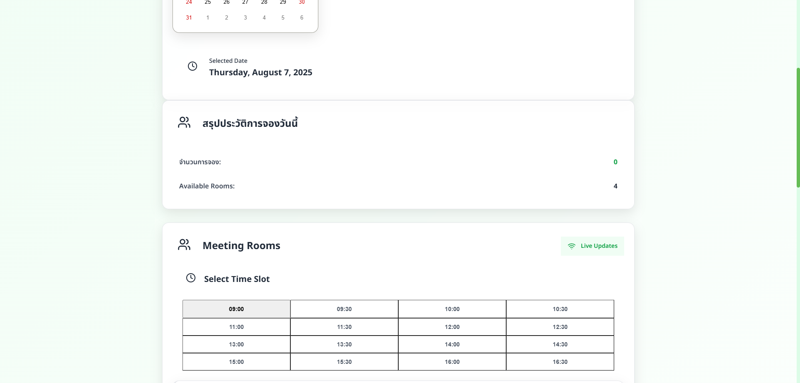
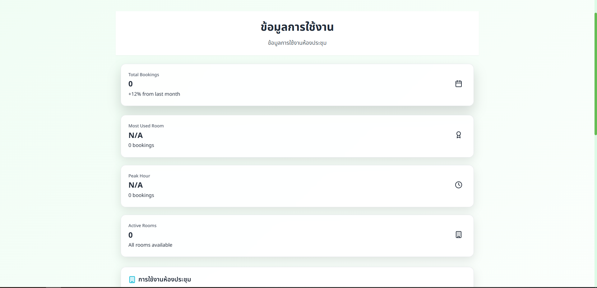

# SSPD Room Reservation System

A modern web application for managing room reservations with real-time updates, built with React frontend and Node.js backend, integrated with Google Sheets for data storage.


## 📸 Screenshots




## 🚀 Features

- **Real-time Booking**: Live updates using Socket.io
- **Room Management**: View and book available rooms
- **Google Sheets Integration**: Automatic data storage and retrieval
- **Statistics Dashboard**: Usage analytics and room utilization

## 📋 Prerequisites

- Docker and Docker Compose
- Google Cloud Platform account with Google Sheets API enabled
- Google Service Account with appropriate permissions

## 🛠️ Installation & Setup

### 1. Clone the Repository
```bash
git clone <your-repository-url>
cd spd-reservation
```

### 2. Google Sheets Setup
1. Create a Google Cloud Project
2. Enable Google Sheets API
3. Create a Service Account
4. Download the service account key as `google-api-key.json`
5. Create a Google Sheet and share it with your service account email
6. Update the spreadsheet ID in `backend/src/services/googleSheets.js`

### 3. Update Configuration
Edit `backend/src/services/googleSheets.js` and update:
```javascript
const SPREADSHEET_ID = 'YOUR_SPREADSHEET_ID';
```

### 4. Build and Run
```bash
# Build the containers
docker-compose build

# Start the application
docker-compose up -d
```

## 🌐 Access URLs

- **Frontend**: `http://localhost:8080`
- **Backend API**: `http://localhost:8081/api`
- **Health Check**: `http://localhost:8081/api/health`

## 📁 Project Structure

```
spd-reservation/
├── frontend/                 # React frontend
│   ├── src/
│   │   ├── components/      # React components
│   │   ├── pages/          # Page components
│   │   ├── services/       # API services
│   │   └── hooks/          # Custom React hooks
│   └── public/             # Static assets
├── backend/                 # Node.js backend
│   ├── src/
│   │   ├── routes/         # API routes
│   │   ├── services/       # Business logic
│   │   └── server.js       # Main server file
│   └── package.json
├── docker-compose.yml       # Docker configuration
├── Dockerfile              # Multi-stage Docker build
└── README.md
```

## 🔧 Configuration

### Environment Variables (Hardcoded)
All configuration is hardcoded for Synology NAS deployment:

- **Frontend API URL**: `http://192.168.1.249:8081/api`
- **Backend Port**: `5000`
- **Frontend Port**: `3000`
- **CORS Origins**: Configured for local network access

### Google Sheets Configuration
- **Spreadsheet ID**: Set in `backend/src/services/googleSheets.js`
- **Service Account**: Credentials hardcoded in the service file
- **Sheet Name**: `Bookings`

## 🚀 Deployment

### Local Development
```bash
docker-compose up --build
```

### Production (Synology NAS)
1. Upload all files to your NAS
2. SSH into your NAS
3. Navigate to the project directory
4. Run:
   ```bash
   docker-compose build
   docker-compose up -d
   ```

### Access from Network
- **Frontend**: `http://YOUR_NAS_IP:8080`
- **Backend**: `http://YOUR_NAS_IP:8081/api`

## 📊 API Endpoints

### Bookings
- `GET /api/bookings` - Get all bookings
- `POST /api/bookings` - Create new booking
- `DELETE /api/bookings/:id` - Cancel booking

### Statistics
- `GET /api/stats` - Get usage statistics

### Health
- `GET /api/health` - Health check endpoint

## 🔒 Security

- Google API credentials are hardcoded (not in environment variables)
- CORS configured for specific origins
- No sensitive data in version control (see `.gitignore`)

## 🐛 Troubleshooting

### Common Issues

1. **CORS Errors**
   - Ensure frontend and backend URLs match
   - Check network connectivity

2. **Google Sheets Permission Denied**
   - Share the spreadsheet with your service account email
   - Verify spreadsheet ID is correct

3. **Port Already in Use**
   - Change ports in `docker-compose.yml`
   - Check for conflicting services

4. **Container Build Failures**
   - Clear Docker cache: `docker system prune`
   - Rebuild: `docker-compose build --no-cache`

### Logs
```bash
# View container logs
docker-compose logs -f

# View specific service logs
docker-compose logs -f spd-reservation
```

## 📝 Development

### Adding New Features
1. Frontend changes: Edit files in `frontend/src/`
2. Backend changes: Edit files in `backend/src/`
3. Rebuild containers: `docker-compose build`
4. Restart: `docker-compose up -d`

### Code Structure
- **Frontend**: React with functional components and hooks
- **Backend**: Express.js with modular routes and services
- **Real-time**: Socket.io for live updates
- **Database**: Google Sheets API